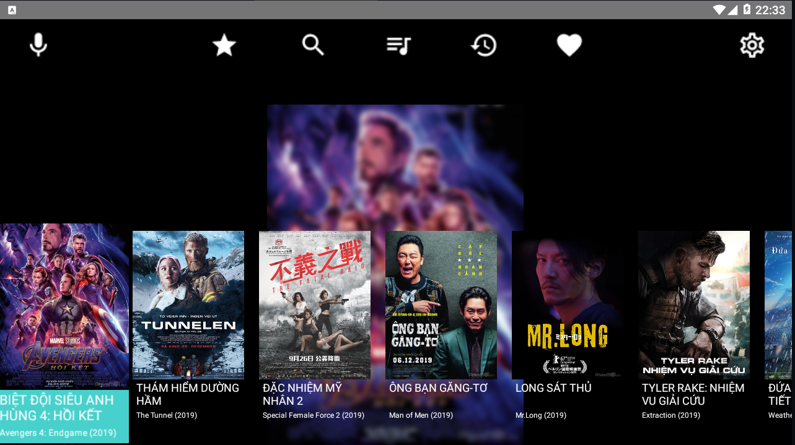
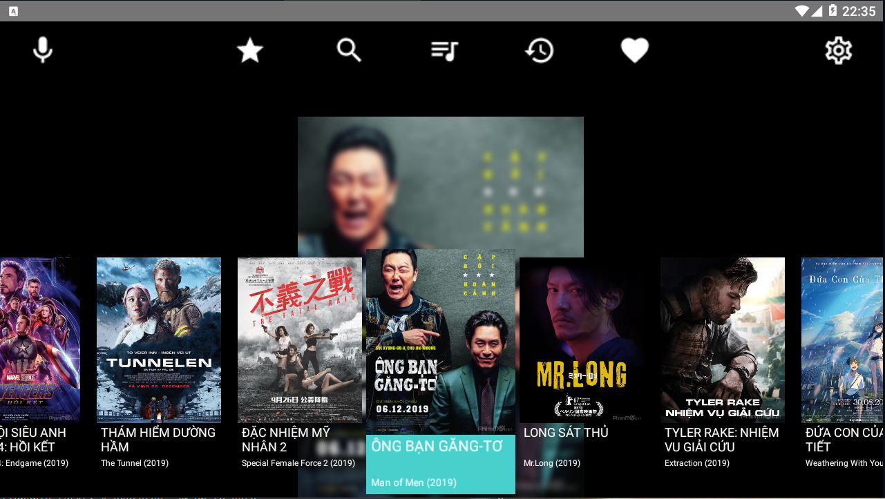

[![LinkedIn][linkedin-shield]][linkedin-url]

  <h3 align="center">TV BOX APP</h3>
  

    TV Box application for android using java Native Language in Android Studio
  

## Demo

  
<h2 style="display: inline-block">Table of Contents</h2>

  <ol>
    <li><a href="#About The Project">About The Project</a></li>
	<li><a href="#Contact">Contact</a></li>
  </ol>

## About The Project

This is my first application from the Course, in this project i making the simple application in Android Studio with java language and Kotlin. In that, i making the custom actionbar with several number of icon to change the fragment. In the main fragment, i using the leanback horizontalgridview look good, to using this gridview i using the Adapter to list with model in class mediaModel.java

## Contact

Hieu Nguyen - [Linkedin](https://www.linkedin.com/in/hieunguyen-dev/)

Linkedin: https://www.linkedin.com/in/hieunguyen-dev/
Email: hnhieu979@gmail.com
Phone: 0927931496
Facebook: https://www.facebook.com/hieu.nguyenmixed

Project Link: [https://github.com/HieuNguyenHuu/TVBoxApp](https://github.com/HieuNguyenHuu/TVBoxApp)

[linkedin-shield]: https://img.shields.io/badge/-LinkedIn-black.svg?style=for-the-badge&logo=linkedin&colorB=555
[linkedin-url]: https://www.linkedin.com/in/hieunguyen-dev/

